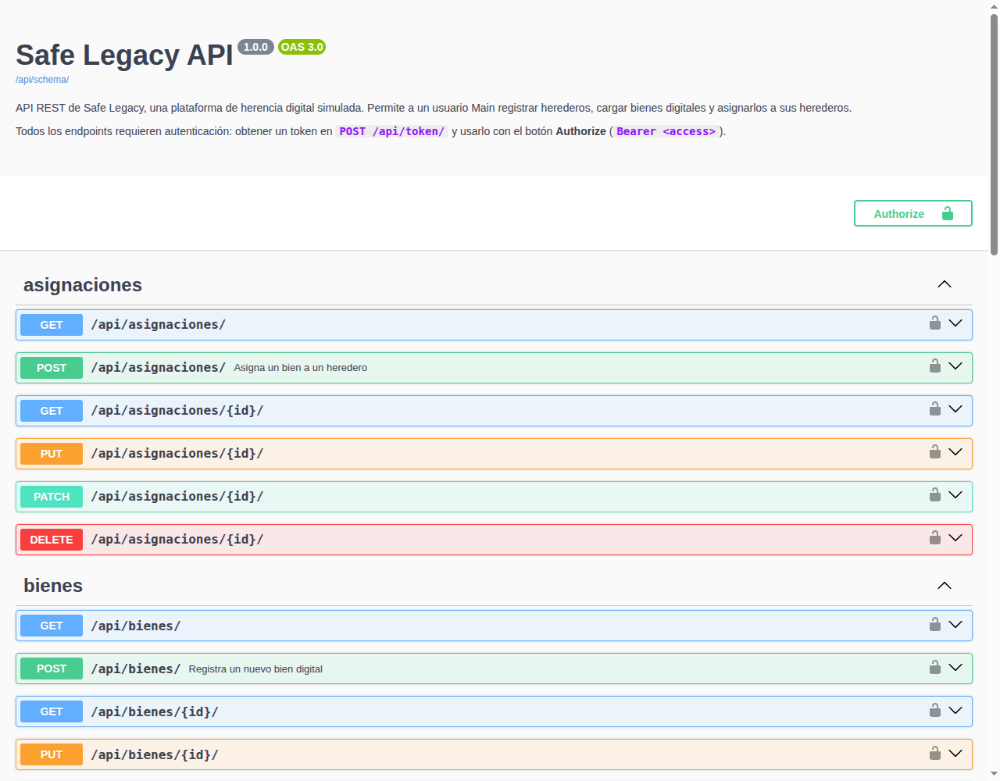
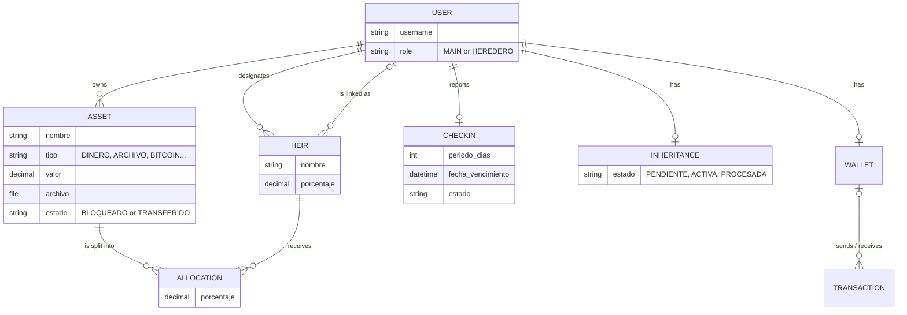

# Safe Legacy API

A REST API for planning a **digital inheritance**: a user registers their heirs and digital assets (money, files, passwords, Bitcoin…) and decides which heir gets what share of each asset if they stop checking in.

> University project (team assignment) built with Django REST Framework. Everything is simulated: no real money, credentials or crypto keys are handled.

## Features
- **JWT authentication**: every endpoint requires a Bearer token, except getting and refreshing the token.
- **Heirs**: a *Main* user registers the people who will inherit from them, optionally linked to their own account.
- **Digital assets**: money, files, images, passwords, documents, Bitcoin and others. Each asset stays `BLOCKED` until the inheritance is released.
- **Asset allocation**: split one asset between several heirs by percentage (e.g. 50% / 50%).
- **Interactive docs**: OpenAPI 3 schema with Swagger UI and ReDoc, generated with drf-spectacular.

## Tech stack
Python 3.12 · Django 6.1 · Django REST Framework · Simple JWT · drf-spectacular · SQLite · uv

## Data model

The code uses Spanish names: `Heredero` (heir), `Bien` (asset), `Asignacion` (allocation), `Herencia` (inheritance), `Billetera` (wallet), `Transaccion` (transaction). `CheckIn`, `Herencia`, `Billetera` and `Transaccion` are modeled but don't have endpoints yet (see [Roadmap](#roadmap)).

## API endpoints
| Method | Endpoint | Description | Auth |
|---|---|---|---|
| POST | `/api/token/` | Get an access/refresh JWT pair | No |
| POST | `/api/token/refresh/` | Get a new access token | No |
| GET | `/api/usuarios/` | List users (read-only) | Yes |
| GET, POST | `/api/herederos/` | List / create heirs | Yes |
| GET, PUT, PATCH, DELETE | `/api/herederos/{id}/` | Retrieve / update / delete an heir | Yes |
| GET, POST | `/api/bienes/` | List / create digital assets | Yes |
| GET, PUT, PATCH, DELETE | `/api/bienes/{id}/` | Retrieve / update / delete an asset | Yes |
| GET, POST | `/api/asignaciones/` | List / create asset allocations | Yes |
| GET | `/api/docs/swagger/` | Interactive API docs | No |

## Run locally
    git clone https://github.com/ValenBelone7/safe-legacy-api.git
    cd safe-legacy-api
    python -m venv venv && source venv/bin/activate
    pip install -r requirements.txt
    cd src
    python manage.py migrate
    python manage.py createsuperuser
    python manage.py runserver

Then open http://127.0.0.1:8000/api/docs/swagger/, call `POST /api/token/` with your superuser, click **Authorize** and paste the `access` token.

If you use [uv](https://docs.astral.sh/uv/), `uv sync` replaces the venv and pip steps.

## What I learned
- **Different serializers for reading and writing.** On `GET`, assets, heirs and allocations return their related objects nested (the owner, the heir's user account), so the client doesn't need extra requests. On `POST`/`PUT`, the same relations are sent as plain IDs. Each ViewSet picks its serializer in `get_serializer_class()` depending on the HTTP method.
- **Avoiding N+1 queries.** Nested serializers trigger one query per related object. Using `select_related()` in the ViewSets (e.g. `bien__propietario`, `heredero__usuario` for allocations) loads everything in a single query.
- **Refactoring from generic views to ViewSets and a router.** The API started with `@api_view` functions and concrete generic views; we unified everything into ViewSets registered in one `DefaultRouter`. That also made it simple to apply `IsAuthenticated` consistently and to generate the OpenAPI docs.
- **401 vs 403.** Putting `JWTAuthentication` first in `DEFAULT_AUTHENTICATION_CLASSES` makes DRF answer `401` with a `WWW-Authenticate: Bearer` header instead of `403` when the token is missing.
- **Modeling an inheritance split.** Instead of one heir per asset, an `Asignacion` table links assets and heirs with a percentage, so one asset can be divided between several heirs. Asset values use 8 decimal places so Bitcoin amounts like `0.05` fit.

## Roadmap
| Stage | Scope | Status |
|---|---|---|
| Assignments 1–2 | Models, nested serializers, CRUD with function and class-based views | Done |
| Assignment 3 | ViewSets, central router, JWT auth | Done |
| Extra | OpenAPI 3 docs with drf-spectacular | Done |
| Next | Check-in endpoints and expiration logic | Planned |
| Next | Inheritance release: transfer allocated assets to heirs | Planned |
| Next | Wallet deposits and transfers | Planned |
| Next | Per-owner object permissions and tests | Planned |

**Known limitation:** any authenticated user can currently see and edit every asset, heir and allocation. Ownership-based permissions are on the roadmap.

## University context
This project was built for a university Django REST Framework course as a team assignment (*Trabajo Práctico*). The full original specification, in Spanish, with roles, business rules and the assignment checklist, is in [docs/README.es.md](docs/README.es.md).

## Authors
Valentín Belone · Tiago Pescara
